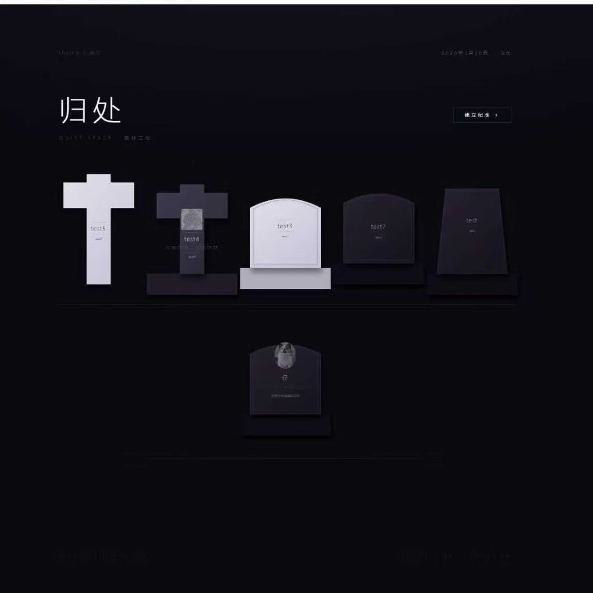
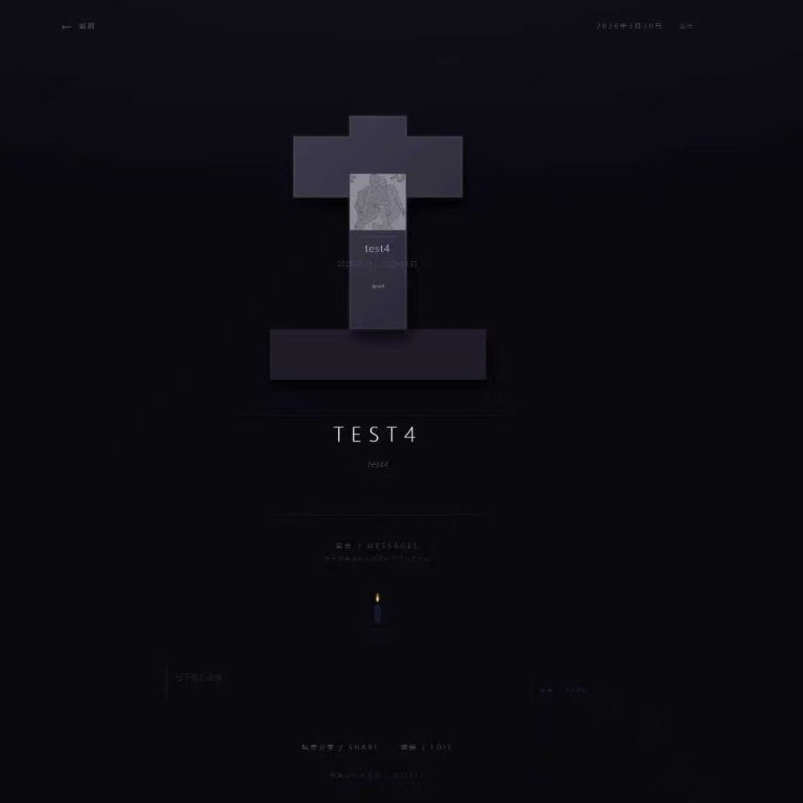
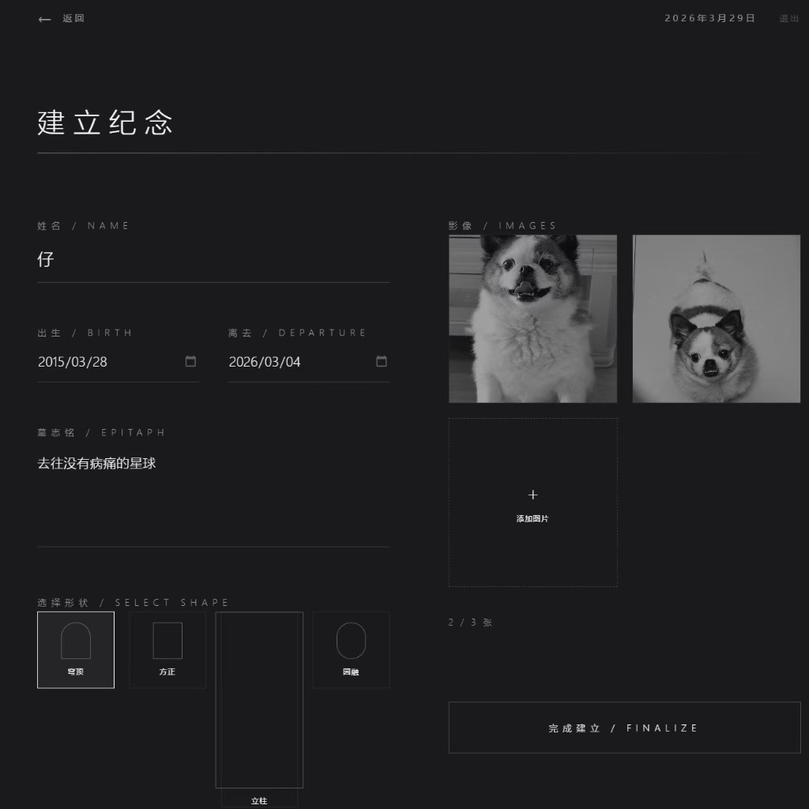

# 归处 · The Return

> 一个赛博墓地。


---

## 简介

**归处**是一款面向个人与家庭纪念场景的数字纪念馆。用户可以为逝去的人（或宠物）创建一座专属数字墓碑，记录姓名、生卒年月、墓志铭与影像，并通过烛光留言与私密分享。

（当然你也可以“祭奠”点别的……）

（或者给自己建一个电子墓碑邀请朋友来欣赏你的墓志铭……）

---

## 截图 / Screenshots

| 电子墓园首页 | 纪念详情页 | 建立纪念 |
|:-----------:|:---------:|:-------:|
|  |  |  |

---

## 功能特性

- **电子墓园首页** — 以交错排列的墓碑卡片呈现所有纪念，营造夜晚墓园的沉浸氛围
- **自定义墓碑形态** — 支持拱形、尖顶、平顶、十字、方尖碑等多种碑形，可调节曲率、底座、材质（花岗岩 / 大理石 / 深色）、边框样式、照片形状
- **墓碑内容刻写** — 照片、姓名、生卒日期（可选填）、墓志铭均以石刻风格呈现在碑面上
- **烛光留言** — 每一条留言对应一盏摇曳的追悼烛光，点击烛光展开留言内容
- **私密分享** — 生成六位访问码，仅与信任的人共享纪念空间
- **编辑纪念** — 随时修改碑文、更换图片、调整碑形
- **游客访问** — 访客通过访问码或直链进入，可浏览并留言，无需注册

---

## 技术栈

| 层级 | 技术 |
|------|------|
| 前端框架 | React 19 + TypeScript |
| 构建工具 | Vite 6 |
| 样式 | Tailwind CSS 4 |
| 动效 | Motion (Framer Motion) |
| 后端 / 数据库 | Supabase (PostgreSQL + Auth + Storage) |
| 部署 | Vercel |

---


## 项目结构

```
src/
├── components/
│   ├── TombstoneRenderer.tsx   # 墓碑 SVG 渲染器
│   ├── ShapeEditor.tsx         # 碑形可视化编辑器
│   ├── LanternWall.tsx         # 烛光留言墙
│   └── BreathingLine.tsx       # 呼吸线氛围组件
├── contexts/
│   └── AuthContext.tsx         # 用户名认证上下文
├── lib/
│   ├── supabase.ts             # Supabase 客户端与数据类型
│   └── tombstoneShape.ts       # 碑形路径生成与主题配置
├── App.tsx                     # 页面路由与主逻辑
└── index.css                   # 全局样式与动效定义
supabase/
└── migrations/
    └── 001_schema_updates.sql  # 数据库迁移脚本
```

---

## 隐私与安全

- 所有纪念数据受 Supabase **Row Level Security (RLS)** 保护，仅创建者可读写
- 游客访问通过 RPC 函数实现，无法批量枚举所有用户数据
- 纪念空间默认私密，仅通过六位访问码定向分享

---

## 路线图

- [ ] 多人共建纪念空间（家庭模式）
- [ ] 纪念日提醒
- [ ] 逝者人生时间轴
- [ ] 移动端体验优化
- [ ] 存储空间优化
- [ ] ......

---

## 声明

本项目主体代码由Google AI Studio + Cursor生成（包括这个README的大部分^^）

更多功能开发完善中……

欢迎提建议和issue~
